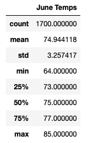
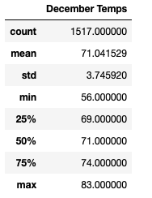
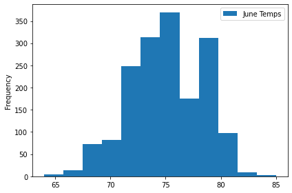
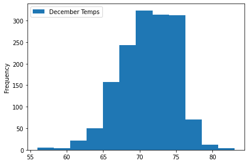

# surfs_up

## Overview of the Analysis

Using the Oahu weather data stored in SQLite and making use of SQLAlchemy tools, this projects aims to describe the key differences in weather between June and December and provide two recommendations for further analysis, in order to determine if a surf and ice cream shop business is sustainable year-round.

## Results 

The three major points from the two analysis deliverables are: 

* The minimum temperature is 64 degrees in June, while the minimum temperature in December is 56 degrees.
* The maximum temperature in June is 85 degrees, while the maximum temperature in December is 83 degrees. 
* The average temperature in June is 74.94 degrees, and the average temperature in December is 71.04 degrees.

## Summary 

The summary statistics for June (Table 1) and December (Table 2) gives us different information for the temperatures during those months. The count is the number of times the temperatures were observed, and the other statistics are the temperature amounts for June and December, respectively. 


##### Table 1 - June Temps Summary Statistics 


##### Table 2 - December Temps Summary Statistics 

To provide better insight on weather patterns in June and December, we could also import the matplotlib dependencies and use the df.plot() function to plot the results and visualize the data frames for both June and December. The codes should look as below.

#### Query to visualize June's dataframe 
```
#creating June's histogram 

df_June.plot.hist(bins=12)

#compressing the x-axis labels

plt.tight_layout()
```

The result would be the graph Graph #1 below. 


##### Graph #1 - June Temperatures 


Based on June's results, we can observe that most of the observations were over 71 degrees this month. If we count up the bins to the right of 71 degrees, we will get about 1,600 days out of the 1,700 observed (94% of the time) where it was over 71 degrees. 

#### Query to visualize December's dataframe 

```
#creating June's histogram 

df_Dec.plot.hist(bins=12)

#compressing the x-axis labels

plt.tight_layout()
```

The result would be the graph Graph #2 below.  


##### Graph #2 - December Temperatures 

In December, the majority of the observations were over 65 degrees. If we count up the bins to the right of 65 degrees, we will get about 1,350 days out of the 1,517 observed (89% of the time) where it was over 65 degrees. 


